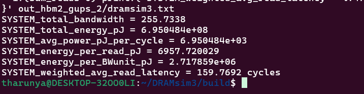

[](https://travis-ci.com/umd-memsys/DRAMsim3)

# About DRAMsim3

DRAMsim3 models the timing paramaters and memory controller behavior for several DRAM protocols such as DDR3, DDR4, LPDDR3, LPDDR4, GDDR5, GDDR6, HBM, HMC, STT-MRAM. It is implemented in C++ as an objected oriented model that includes a parameterized DRAM bank model, DRAM controllers, command queues and system-level interfaces to interact with a CPU simulator (GEM5, ZSim) or trace workloads. It is designed to be accurate, portable and parallel.
    
If you use this simulator in your work, please consider cite:

[1] S. Li, Z. Yang, D. Reddy, A. Srivastava and B. Jacob, "DRAMsim3: a Cycle-accurate, Thermal-Capable DRAM Simulator," in IEEE Computer Architecture Letters. [Link](https://ieeexplore.ieee.org/document/8999595)

See [Related Work](#related-work) for more work done with this simulator.


## Building and running the simulator

This simulator by default uses a CMake based build system.
The advantage in using a CMake based build system is portability and dependency management.
We require CMake 3.0+ to build this simulator.
If `cmake-3.0` is not available,
we also supply a Makefile to build the most basic version of the simulator.

### Building

Doing out of source builds with CMake is recommended to avoid the build files cluttering the main directory.

```bash
# cmake out of source build
mkdir build
cd build
cmake ..

# Build dramsim3 library and executables
make -j4

# Alternatively, build with thermal module enabled
cmake .. -DTHERMAL=1

```

The build process creates `dramsim3main` and executables in the `build` directory.
By default, it also creates `libdramsim3.so` shared library in the project root directory.

### Running

```bash
# help
./build/dramsim3main -h

# Running random stream with a config file
./build/dramsim3main configs/DDR4_8Gb_x8_3200.ini --stream random -c 100000 

# Running a trace file
./build/dramsim3main configs/DDR4_8Gb_x8_3200.ini -c 100000 -t sample_trace.txt

# Running with gem5
--mem-type=dramsim3 --dramsim3-ini=configs/DDR4_4Gb_x4_2133.ini

```

The output can be directed to another directory by `-o` option
or can be configured in the config file.
You can control the verbosity in the config file as well.

### Output Visualization

`scripts/plot_stats.py` can visualize some of the output (requires `matplotlib`):

```bash
# generate histograms from overall output
python3 scripts/plot_stats dramsim3.json

# or
# generate time series for a variety stats from epoch outputs
python3 scripts/plot_stats dramsim3epoch.json
```

Currently stats from all channels are squashed together for cleaner plotting.

### Integration with other simulators

**Gem5** integration: works with a forked Gem5 version, see https://github.com/umd-memsys/gem5 at `dramsim3` branch for reference.

**SST** integration: see http://git.ece.umd.edu/shangli/sst-elements/tree/dramsim3 for reference. We will try to merge to official SST repo.

**ZSim** integration: see http://git.ece.umd.edu/shangli/zsim/tree/master for reference.

## Simulator Design

### Code Structure

```
├── configs                 # Configs of various protocols that describe timing constraints and power consumption.
├── ext                     # 
├── scripts                 # Tools and utilities
├── src                     # DRAMsim3 source files
├── tests                   # Tests of each model, includes a short example trace
├── CMakeLists.txt
├── Makefile
├── LICENSE
└── README.md

├── src  
    bankstate.cc: Records and manages DRAM bank timings and states which is modeled as a state machine.
    channelstate.cc: Records and manages channel timings and states.
    command_queue.cc: Maintains per-bank or per-rank FIFO queueing structures, determine which commands in the queues can be issued in this cycle.
    configuration.cc: Initiates, manages system and DRAM parameters, including protocol, DRAM timings, address mapping policy and power parameters.
    controller.cc: Maintains the per-channel controller, which manages a queue of pending memory transactions and issues corresponding DRAM commands, 
                   follows FR-FCFS policy.
    cpu.cc: Implements 3 types of simple CPU: 
            1. Random, can handle random CPU requests at full speed, the entire parallelism of DRAM protocol can be exploited without limits from address mapping and scheduling pocilies. 
            2. Stream, provides a streaming prototype that is able to provide enough buffer hits.
            3. Trace-based, consumes traces of workloads, feed the fetched transactions into the memory system.
    dram_system.cc:  Initiates JEDEC or ideal DRAM system, registers the supplied callback function to let the front end driver know that the request is finished. 
    hmc.cc: Implements HMC system and interface, HMC requests are translates to DRAM requests here and a crossbar interconnect between the high-speed links and the memory controllers is modeled.
    main.cc: Handles the main program loop that reads in simulation arguments, DRAM configurations and tick cycle forward.
    memory_system.cc: A wrapper of dram_system and hmc.
    refresh.cc: Raises refresh request based on per-rank refresh or per-bank refresh.
    timing.cc: Initiate timing constraints.
```

## Experiments

### Verilog Validation

First we generate a DRAM command trace.
There is a `CMD_TRACE` macro and by default it's disabled.
Use `cmake .. -DCMD_TRACE=1` to enable the command trace output build and then
whenever a simulation is performed the command trace file will be generated.

Next, `scripts/validation.py` helps generate a Verilog workbench for Micron's Verilog model
from the command trace file.
Currently DDR3, DDR4, and LPDDR configs are supported by this script.

Run

```bash
./script/validataion.py DDR4.ini cmd.trace
```

To generage Verilog workbench.
Our workbench format is compatible with ModelSim Verilog simulator,
other Verilog simulators may require a slightly different format.


## Related Work

[1] Li, S., Yang, Z., Reddy D., Srivastava, A. and Jacob, B., (2020) DRAMsim3: a Cycle-accurate, Thermal-Capable DRAM Simulator, IEEE Computer Architecture Letters.

[2] Jagasivamani, M., Walden, C., Singh, D., Kang, L., Li, S., Asnaashari, M., ... & Yeung, D. (2019). Analyzing the Monolithic Integration of a ReRAM-Based Main Memory Into a CPU's Die. IEEE Micro, 39(6), 64-72.

[3] Li, S., Reddy, D., & Jacob, B. (2018, October). A performance & power comparison of modern high-speed DRAM architectures. In Proceedings of the International Symposium on Memory Systems (pp. 341-353).

[4] Li, S., Verdejo, R. S., Radojković, P., & Jacob, B. (2019, September). Rethinking cycle accurate DRAM simulation. In Proceedings of the International Symposium on Memory Systems (pp. 184-191).

[5] Li, S., & Jacob, B. (2019, September). Statistical DRAM modeling. In Proceedings of the International Symposium on Memory Systems (pp. 521-530).

[6] Li, S. (2019). Scalable and Accurate Memory System Simulation (Doctoral dissertation).

##  Project Modifications (CA-1 and Phase-2 Controller Optimizations)

This repository contains additional modifications implemented on top of the original DRAMsim3 simulator.  
The purpose of these modifications is to evaluate memory controller behavior and improve performance for specific workloads using two optimizations:

• **CA-1 (Channel Addressing Optimization)**  
• **Phase-2 Controller Scheduling Optimization**

These optimizations were evaluated using **HBM2 configurations** and memory traces such as **STREAM** and **GUPS**.

---

## Modified Source Files

The CA-1 implementation modifies several core DRAMsim3 files located in `src/`.

Modified files:
src/controller.cc
src/controller.h
src/configuration.cc
src/configuration.h
src/dram_system.cc
src/dram_system.h


These files implement the CA-1 logic including:

- Channel selection logic
- Address remapping behavior
- Configuration parameters required for the optimization
- Controller behavior updates

---


If users want to test the **default DRAMsim3 behavior**, they can replace the modified files with these `.ORIGINAL` versions.

---

The complete combined implementation of **CA-1 + Phase-2 scheduling optimization** is stored in the following files:

- `src/controller.cc`
- `src/Pcontroller.h`


These files contain the full controller implementation used for the final optimized experiments.


Phase-2 improves command scheduling by modifying how commands are selected and issued within the memory controller.

---

## Modified Configuration File

The configuration used for the experiments is:
```bash
configs/HBM2_8Gb_x12_powerfix1.ini
```
The configuration includes several knobs that control the optimizations:

- `CA1_enable` – enables or disables CA-1 optimization  
- `phase2_enable` – enables or disables Phase-2 scheduling  
- `XOR_mask` – controls address remapping for channel distribution  
- `threshold` – parameter used in CA-1 decision logic

##  Trace file
Here GUPS and STREAM workloads are tested which are in the folder:

- `traces/stream/`
- `traces/gups/`
## Workload Generation

The workloads used in this project were derived from the following benchmark suites:

STREAM (memory bandwidth benchmark):
https://github.com/jeffhammond/STREAM

GUPS (Random memory access benchmark):
https://github.com/alexandermerritt/gups

These benchmarks were used to generate memory access traces which were then used as inputs for the DRAMsim3 simulations. 
```bash
DRAMsim3/
│
├── src/
│ ├── controller.cc
│ ├── controller.h
│
├── configs/
│ └── HBM2_8Gb_x128_powerfix1.ini
│
├── traces/
│ ├── stream/stream_1s.dramsim3.trace
│ └── gups/gups.dramsim3.strict_full_dealias.trace
│
├── build/
└── README.md
```

## Modified Configuration File

The configuration includes several knobs that control the optimizations:

- `CA1_enable` – enables or disables CA-1 optimization  
- `phase2_enable` – enables or disables Phase-2 scheduling  
- `XOR_mask` – controls address remapping for channel distribution  
- `threshold` – parameter used in CA-1 decision logic

## instructions to run the code
example for HBM2( the modified config)
```bash
./build/dramsim3main \
~/configs/HBM2_8Gb_x128_powerfix1.ini \
-t ~/traces/stream/stream_1s.dramsim3.trace \
-o <out_dir>
```
## instructions to see the required parameter 
```bash
 awk '
/^## Statistics of Channel/ {ch=$5}
/^num_cycles/ {cycles=$3}
/^average_bandwidth/ {bw[ch]=$3}
/^total_energy/ {en[ch]=$3}
/^average_read_latency/ {lat[ch]=$3}
/^num_reads_done/ {reads[ch]=$3}
END{
  sum_bw=0; sum_en=0; sum_reads=0; wlat=0;
  for(c in bw) sum_bw += bw[c];
  for(c in en) sum_en += en[c];
  for(c in reads){ sum_reads += reads[c]; wlat += reads[c]*lat[c]; }

  printf("SYSTEM_total_bandwidth = %.4f\n", sum_bw);
  printf("SYSTEM_total_energy_pJ = %.6e\n", sum_en);
  if(cycles>0)   printf("SYSTEM_avg_power_pJ_per_cycle = %.6e\n", sum_en/cycles);
  if(sum_reads>0)printf("SYSTEM_energy_per_read_pJ = %.6f\n", sum_en/sum_reads);
  if(sum_bw>0)   printf("SYSTEM_energy_per_BWunit_pJ = %.6e\n", sum_en/sum_bw);
  if(sum_reads>0)printf("SYSTEM_weighted_avg_read_latency = %.4f cycles\n", wlat/sum_reads);
}' <out_dir>/dramsim3.txt
```
## Example Output

After running the simulator, the output statistics should appear as shown below:

